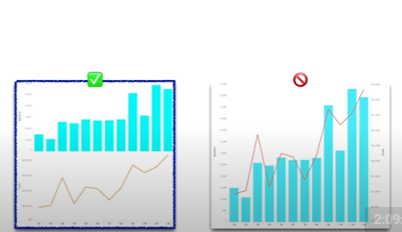
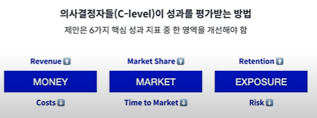

# 데이터 시각화와 스토리텔링

## 비즈니스에서 데이터 시각화의 효과
 **빠르게 액션 가능한 인사이트**를 찾고 커뮤니케이션 기능

### 고객의 니즈를 반영하기 위해
-> 메트릭을 정해서 데이터를 측정하고 개선
 
-> 모든 행동을 데이터화하고 고객의 피드백을 학습하며 개속 개선하는 여정

    ex. 가입, 클릭, 좋아요, 구독, 접속 시간, 탈퇴 -> 피드백을 데이터로 분석하고 개선을 위한 액션 도출

 이 과정에서 데이터 시각화가 유용하게 쓰임

 ## 데이터 시각화를 잘 하려면 
  시각화의 문법 + 비즈니스 상황 => 데이터 시각화

  ### 시각화의 문법, 좋은 시각화의 공식

'얼마나 정확하고 자세한가'가 아닌 **'가장 중요한 것을 얼마나 쉽게 확인 할 수 있는가`**

 시그널은 최대화, 노이즈는 최소화 정보 전달의 효율성을 생각해야 함.
     
1. 데이터 잉크 비율을 높이자. 
      표횬하고자 하는 데이터 외에는 불필요한 장식을 없애자

2. 3D 차트 X

3. 막대그래프의 축은 반드시 0부터 시작
    
    차이가 과도하게 강조되어 사실을 왜곡하게 됨

4. 꺽은선 그래프는 축을 잘라내도 괜찮음

    꺾은선 그래프의 역할은 선의 기울기로 경향을 파악하는 것

5. 색은 강조하고 싶은 요소에만 사용하기.

    색상에 시각화의 목적을 반영하여 보는 사람이 보기 쉽게 하기

6. 이중축은 혼란의 여지가 있음
    

7. 산포도는 가로축에 선행지표, 세로축에 후행지표를 표시

    산포도의 상관관계는 인과관계를 나타내지는 않지만, 일반론으로 성립된다고 생각하는 경우 해석의 용이성을 위해

8. 시간 축은 가로축이 기본

### 비즈니스 상황

#### 비즈니스 대시보드 제작 공식

##### Exploartory Analysis

 탐색적으로 분석하면서 패턴과 인사이트를 찾아가는 과정

##### Explanatory Analysis

 중요한 메트릭을 강조하면서 특정한 인사이트를 설명하는 대시보드

#### Explanatory Analysis 대시보드 제작할 때 유의점

 - WHY : 유저가 대시보드를 사용해야 하는 이유

 - WHAT : 대시보드의 기능 자체, 유저가 할 수 있는 것

 - HOW : 기능들이 시작적으로 잘 **디자인** 됐는가

##### 대시보드 기능 설계
 1. 문제 정의에 따른 요구사항 정리 후 **우선순위 설정**
 2. 우선순위에 따라 중요한 워크시트부터 VIEW NAME 설정
 3. 뷰를 만드는 데 필요한 DATA FIELDS 결정
 4. 어떤 CALCUALATION 이 요구되는 지 파악하기
 5. 유저에 따라 적합한 VISUALIZATION 생성

###### RFM 분석

### 스토리텔링
> Data doesn't speak for itself. it needs a storyteller

스로리의 3단 구성
 
    컨텍스트 설명 -> 핵심 메시지(문제와 기회) -> 추천하는 액션

 의사결정자(C-level)d이 성과를 평가받는 법
    

## 출처
- https://www.youtube.com/watch?v=H0YczgxTXY0
